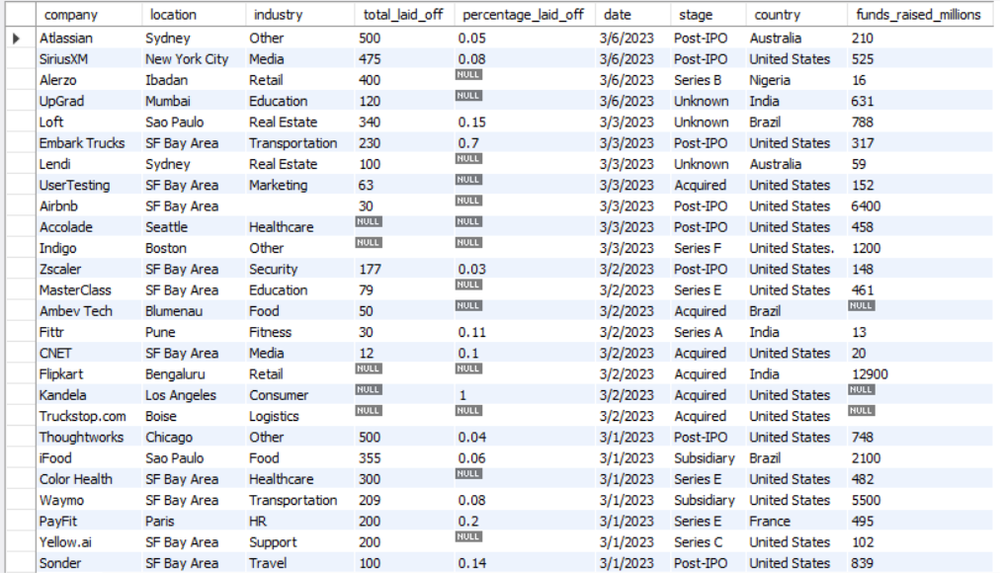
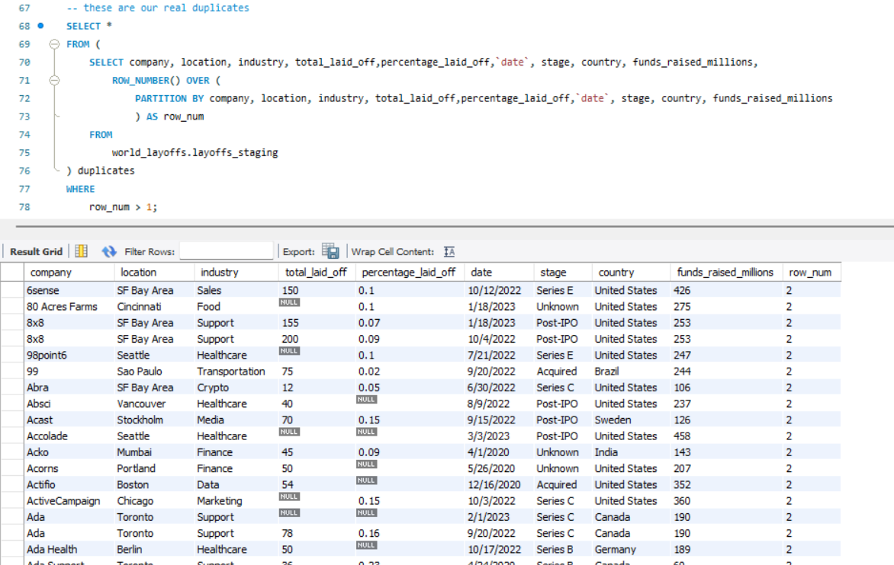
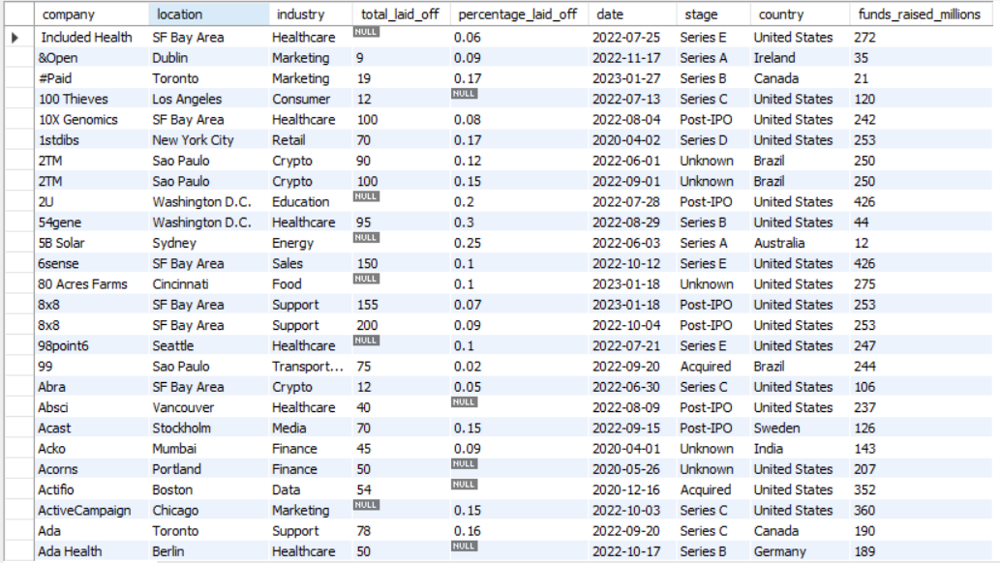

# 🧹 SQL Data Cleaning Project

## 📌 Overview

This project focuses on cleaning and preprocessing a real-world dataset using SQL.
The goal is to improve data quality and prepare it for analysis.

---

## ⚙️ Data Cleaning Steps

* 🔁 Removed duplicate records using window functions
* ❌ Handled missing and null values
* 🧽 Standardized inconsistent data formats
* 📅 Converted date fields into proper format
* 🗑️ Removed irrelevant or incomplete records

---

## 🛠️ Tools Used

* 🗄️ SQL (MySQL)
* 💻 MySQL Workbench

---

## 📊 Results

A clean and structured dataset ready for analysis and further processing.

---

## 📸 Screenshots

### 🔹 Raw Dataset



### 🔹 Duplicate Detection



### 🔹 Final Cleaned Data



## 📁 Project Structure

```
sql-data-cleaning-project/
│
├── data/
├── sql/
├── screenshots/
└── README.md
```

---

## 🚀 Key Skills Demonstrated

* Data Cleaning
* SQL Querying
* Data Preprocessing
* Data Quality Management

---

## 💡 Conclusion

This project demonstrates how raw data can be transformed into a reliable dataset using structured SQL techniques.
